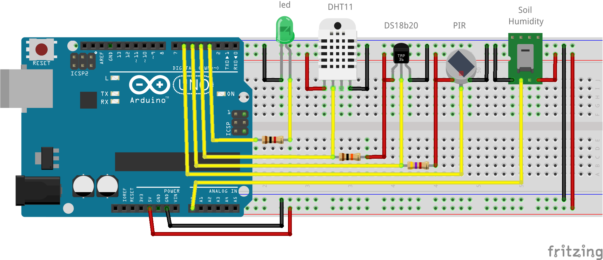
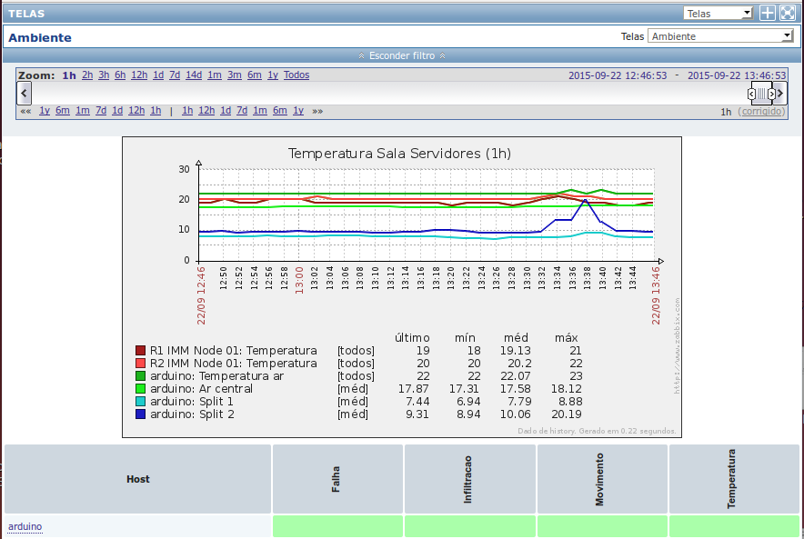

# Arduino-Zabbix-Agent

Using an Arduino Uno v3 and a Zabbix Server to monitor a data center environment.

It's a Zabbix Agent tested and running successfully.

* [Materials](#materials)
* [Schematic](#schematic)
* [More info](#more-info)
  * [DHT11](#dht11)
  * [DS18b20](#ds18b20)
  * [PIR](#pir)
  * [Soil humidity sensor](#soil-humidity-sensor)
  * [Led](#led)
  * [Observation](#observation)
* [How to use](#how-to-use)
* [Keys used on Zabbix](#keys-used-on-zabbix)
* [On the code](#on-the-code)
* [Example](#example)


## Materials:

- Arduino Uno v3
- Ethernet Shield
- Arduino Sensor Shield*
- DHT11 (or similar) and one 10k resistor
- DS18b20 (or similar) and one 4.7k resistor
- PIR (Passive infrared sensor/Motion detector)
- Soil humidity sensor
- One led and one 1k resistor

###### *A new shield may be built by yourself.

## Schematic:

Schematic done using [Fritzing](http://www.fritzing.org).

### More info:

#### `DHT11`
This sensor can measure the air temperature and humidity. It doesn't need to be calibrated. It is recommended to take 1 sample per second or less. It returns one `int` for each data. The temperature is in Celsius. A 10k resistor must be connected to pins Vcc and Signal.

#### `DS18b20`
This sensor is responsible for measuring the air temperature and returning a `float`. It is fast enough to take one sample for each Arduino cpu clock. It doesn't need to be calibrated and is water-proof. The library `OneWire` is used for reading its data. This means it is possible to connect multiple DS18b20 sensors on a single Arduino port. The temperature is in Celsius. A single 4.7k resistor must be conected between Vcc and the pin connected to one or more sensor.

#### `PIR`
Plug and play sensor. Doesn't need resistor or adjustments. Its signal must be connected to an Arduino port and that's all. Returns `1` when detects motion and `0` when nothing is detected.

#### `Soil humidity sensor`
Tricky sensor. It returns `1` when it's dry and `0` when it detects humidity. Its output is digital. The sensibility must be adjusted by turning a small screwdriver on the sensor.

#### `Led`
Be careful! Leds are extremely fragile. It needs a 1k resistor in series to make it work. The brightness may vary depending on the model and color. In this project, the led is turned on when the Arduino receives a command and
is turned off when the value is returned to the server.

### Observation:
All temperature are in Celsius.
To convert to Fahrenheit:
```
Temp F = 1.8*(Temp C) + 32
```


## How to use:

Check pins used.
Upload the code to the Arduino.
Add an item on Zabbix Server.
 - Type: Zabbix agent.
 - Key: The key for each sensor (`q`, `w`, `e`, `r`, `t` etc).
 - It is recommended to check each item on not less than once a minute.

## Keys used on Zabbix:

* q - soil humidity
* w - air temperature on DHT11
* e - air humidity on DHT11
* r - air temperature on DS18b20 with serial number ending with 17
* f - air temperature on DS18b20 with serial number ending with B6
* v - air temperature on DS18b20 with serial number ending with D3
* t - motion detector

## On the code:

*Pins 10, 11, 12 and 13 cannot be used. They are used by the ethernet shield*.

Pin 3 is the led.

Pin 4 is the DHT11.

Pin 5 is one or more DS18b20 (using OneWire).

Pin 6 is the PIR.

Pin A0 is the soil humidity sensor.

## Example:



---
Zabbix Agent on Arduino Uno v3
